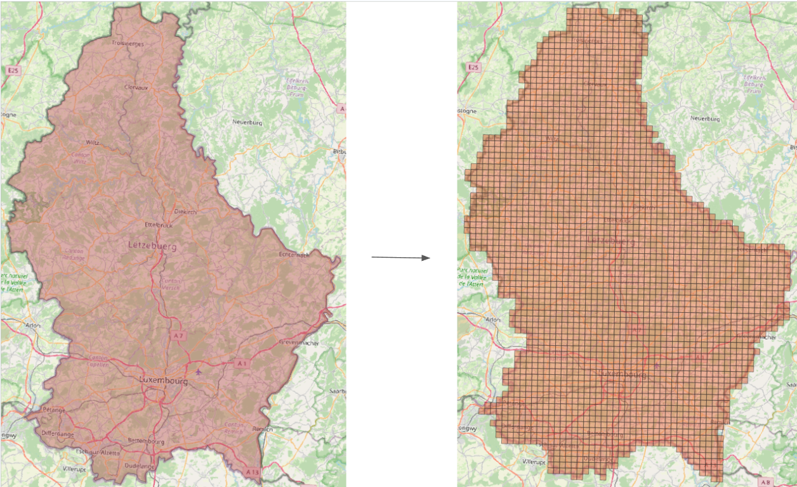
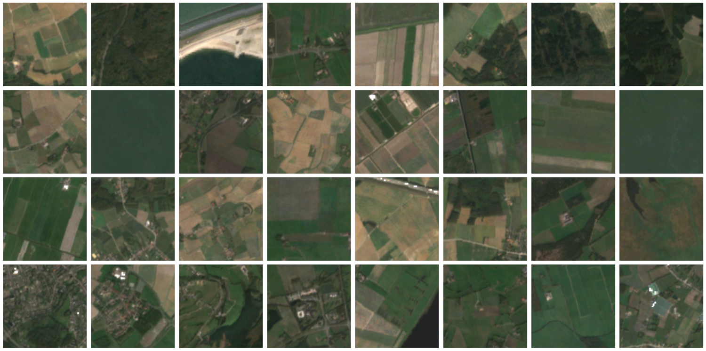
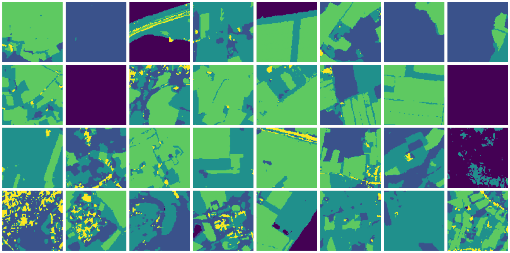
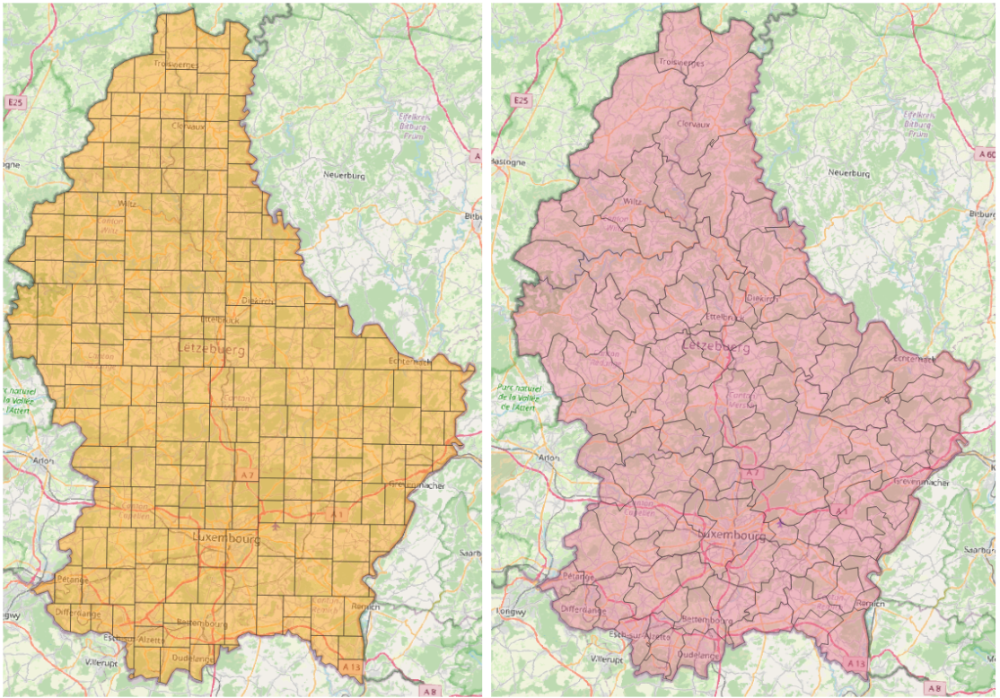
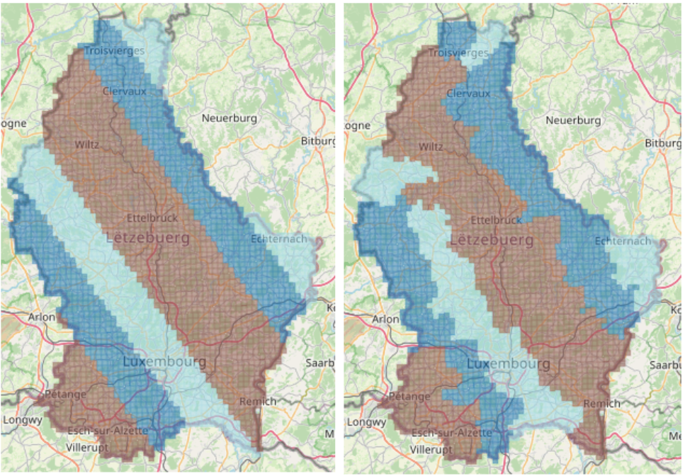
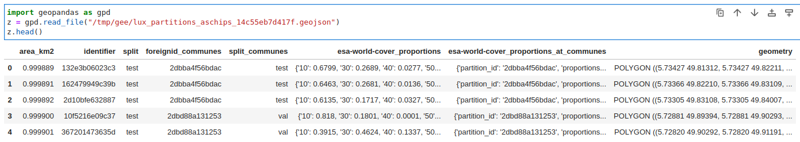

# geetiles

## download Google Earth Engine datasets to tiles as geotiff arrays

Uses the [Google Earth Engine High Volume Endpoint](https://developers.google.com/earth-engine/cloud/highvolume) which, according to the documentation:

> This service is designed to support a much larger number of simultaneous requests per user, but provides less caching, so it's best for small queries that don't involve any sort of aggregation (like fetching tiles from pre-built images).

install with

    pip install geetiles

### 1. create grid on a given area of interest as wkt

    geet grid --aoi_wkt_file luxembourg.wkt  --chip_size_meters 1000 --aoi_name lux --dest_dir .

you can find the file `luxembourg.wkt` under `data`. Usually you would have to provide your own with your area of interest, with coordinates expressed in WSG84 degrees lon/lat.

this generates file `./lux_partitions_aschips_14c55eb7d417f.geojson`. Use a tool such as [QGIS](https://qgis.org/) to view it.

### 2. download tiles

    geet download --tiles_file lux_partitions_aschips_14c55eb7d417f.geojson  --gee_image_pycode sentinel2-rgb-median-2020 --pixels_lonlat [100,100] --skip_if_exists

this fills the folder `lux_partitions_aschips_14c55eb7d417f/sentinel2-rgb-median-2020` with RGB geotiff images of size 100x100 pixels.

If using `sentinel2-rgb-median-2020` as `gee_image_pycode`, which is an alias to [Sentinel-2 MSI Level 2-A](https://developers.google.com/earth-engine/datasets/catalog/COPERNICUS_S2_SR) GEE dataset, taking the median of the cloudless chips over the year 2020.

If using `esa-world-cover` as `gee_image_pycode`, which is an alias to [ESA WorldCover 10m v100](https://developers.google.com/earth-engine/datasets/catalog/ESA_WorldCover_v100) GEE dataset.

## Other usages

### Other ways to create the set of tiles (shapes) 

- As random partitions with at most 5km size length (figure below left).

      geet random --aoi_wkt_file luxembourg.wkt  --max_rectangle_size_meters 20000 --aoi_name lux --dest_dir .

- Using the reference administrative divisions at [EU Eurostat](https://ec.europa.eu/eurostat/web/gisco/geodata/reference-data/administrative-units-statistical-units/countries) (figure below right)

      geet select --orig_shapefile COMM_RG_01M_2016_4326.zip --aoi_wkt_file luxembourg.wkt --tiles_name communes --aoi_name lux --dest_dir .

### Using your own code to define the GEE source image object.

    geet download --tiles_file lux_partitions_aschips_14c55eb7d417f.geojson  --gee_image_pycode crops.py --dataset_name crop --pixels_lonlat [100,100] --skip_if_exists --skip_confirm --n_processes 20

assuming the file `crops.py` contains the following code

        import ee

        def get_ee_image():
            return ee.Image('USGS/GFSAD1000_V1')\
                     .select('landcover')\
                     .visualize(min=0.0, max=5.0,
                                palette = ['black', 'orange', 'brown', 
                                           '02a50f', 'green', 'yellow'])

        def get_dataset_name():
            return 'crops'

The `crops.py` will be saved under the destination folder for reference. The destination folder is created alongside the `tiles-file`.

### Split geometries in train, test, val using geographic bands

With a certain angle

    geet split --tiles_file lux_partitions_aschips_14c55eb7d417f.geojson --nbands 8 --train_pct .5 --test_pct 0.3 --val_pct 0.2  --angle 0.78

Keeping chips within the same coarser geometry in the same split. In this case, the train/test/val proportions may vary from the ones specified as chips will be distributed across the coarser geometries. First we must intersect the geometries

    geet intersect --tiles_file lux_partitions_aschips_14c55eb7d417f.geojson --foreign_tiles_file lux_partitions_communes_1a471c686e053.geojson

and then, do the split

    geet split --tiles_file lux_partitions_aschips_14c55eb7d417f.geojson --nbands 8 --train_pct .5 --test_pct 0.3 --val_pct 0.2  --angle 0.785 --foreign_tiles_name communes

here is how it would result.

### Computing label proportions

With respect to a dataset downloaded with segmentation labels.

    geet lp.compute --tiles_file lux_partitions_aschips_14c55eb7d417f.geojson --dataset_name esa-world-cover

We can also add the label proportions of the coarser tile in which each chip is embedded. First, we need to download the labels for each coarser tile from GEE.

    geet download --tiles_file lux_partitions_communes_1a471c686e053.geojson  --gee_image_pycode esa-world-cover  --meters_per_pixel 20  --skip_if_exists 

then, compute the label proportions at this coarser tiles:

    geet lp.compute --tiles_file lux_partitions_communes_1a471c686e053.geojson --dataset_name esa-world-cover

and then compute the label proportions from the coarser tiles.

    geet lp.from_foreign --tiles_file lux_partitions_aschips_14c55eb7d417f.geojson --foreign_tiles_file lux_partitions_communes_1a471c686e053.geojson --dataset_name esa-world-cover

The resulting proportions are added in the corresponding `tiles_file`

### Creating a dataset to share it

This will create a zip file, with a pickle per chip containing a dictionary with the chip image, label and proportions.

    geet zip.dataset --tiles_file lux_partitions_aschips_14c55eb7d417f.geojson --foreign_tiles_file lux_partitions_communes_1a471c686e053.geojson --images_dataset_name sentinel2-rgb-median-2020 --labels_dataset_name esa-world-cover --readme_file README.txt  --label_map [10,20,30,40,50,60,70,80,90,95,100]

### Some notes

- the hash codes in the name files are computed using the participating geometries. This ensures that changing geometries do not override each other(such as for random partitions, or a wkt with slightly different coordinates).
- the splits are saved both as a column in the corresponding `tiles_file` (which is a `geojson`) and in a separte `csv` file. This is to enable fast loading from `csv` (as loading from `geojson` might take a while, especially for large dataset).
