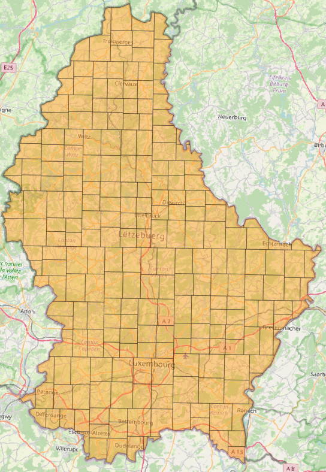
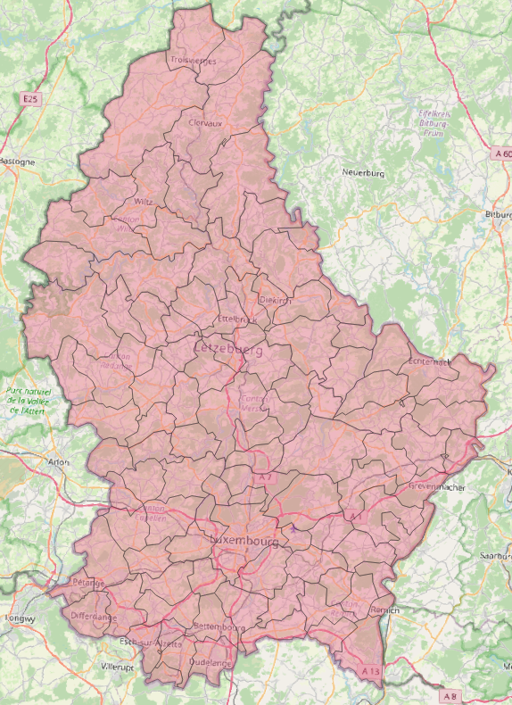

# geedatasets

## download Google Earth Engine datasets to tiles as geotiff arrays

install with

    pip install geedatasets

### 1. create grid on a given area of interest as wkt

    geed grid --aoi_wkt_file luxembourg.wkt  --chip_size_meters 1000 --aoi_name lux --dest_dir .

this generates file `./lux_partitions_aschips_14c55eb7d417f.geojson`

### 2. download tiles

    geed download --tiles_file lux_partitions_aschips_14c55eb7d417f.geojson  --gee_image_pycode 'sentinel2-rgb-median-2020' --dataset_name s2 --pixels_lonlat [100,100] --skip_if_exists --skip_confirm

this fills the folder `lux_partitions_aschips_14c55eb7d417f/s2` with RGB geotiff images of size 100x100 pixels.

If using `sentinel2-rgb-median-2020`, which is an alias to [Sentinel-2 MSI Level 2-A](https://developers.google.com/earth-engine/datasets/catalog/COPERNICUS_S2_SR) GEE dataset, taking the median of the cloudless chips over the year 2020.

If using `esa-world-cover`, which is an alias to [ESA WorldCover 10m v100](https://developers.google.com/earth-engine/datasets/catalog/ESA_WorldCover_v100) GEE dataset.

## Other usages

### Other ways to create the set of tiles (shapes) 

- As random partitions with at most 5km size length.

      geed random --aoi_wkt_file luxembourg.wkt  --max_rectangle_size_meters 20000 --aoi_name lux --dest_dir .

- Using the reference administrative divisions in at [EU Eurostat](https://ec.europa.eu/eurostat/web/gisco/geodata/reference-data/administrative-units-statistical-units/countries)

      geed select --orig_shapefile COMM_RG_01M_2016_4326.shp --aoi_wkt_file notebooks/luxembourg.wkt --partition_name comms --aoi_name lux --dest_dir .

### Using your own code to define the GEE source image object.

    geed download --tiles_file lux_partitions_aschips_14c55eb7d417f.geojson  --gee_image_pycode crops.py --dataset_name crop --pixels_lonlat [100,100] --skip_if_exists --skip_confirm

assuming the file `crops.py` contains the following code

        import ee

        def get_ee_image():
            return ee.Image('USGS/GFSAD1000_V1').select('landcover')\
                    .visualize(min=0.0, max=5.0,
                                palette = ['black', 'orange', 'brown', 
                                           '02a50f', 'green', 'yellow'])

